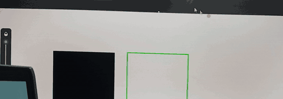
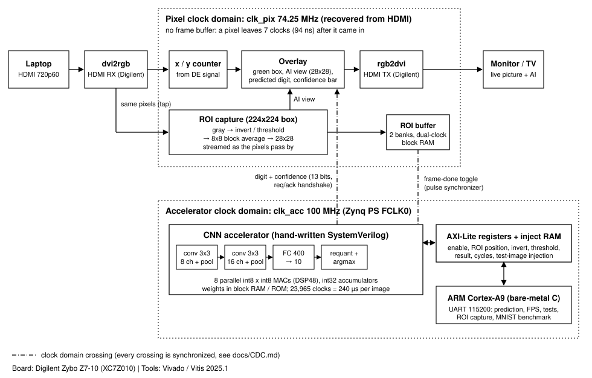

# Real-Time Edge AI Video Processor on FPGA

**Live HDMI video goes through a Zybo Z7-10 FPGA. A small neural network, written by hand in SystemVerilog, reads the handwritten digit inside a box on the screen. The answer is drawn on the live video, at 60 frames per second, with no frame buffer.**



**[Watch the 33-second demo on YouTube](https://youtu.be/mclvHZH5C0E)** (laptop &rarr; FPGA &rarr; TV; left to right on the screen: what the AI sees, the green box, the prediction and a confidence bar. An empty box shows nothing.)

## Highlights (all measured, see [docs/RESULTS.md](docs/RESULTS.md) for how)

| | |
|---|---|
| Video | 1280x720 @ 60 Hz in, same out. **3,601 frames and 3,601 inferences in 60 s: 60.00 FPS, 0 skipped.** Video path latency: 7 pixel clocks (94 ns) |
| CNN speed | **240 &micro;s per image** (23,965 clocks at 100 MHz), 8 parallel MACs |
| vs. ARM Cortex-A9 | **9.6x faster** than the same integer CNN in plain C on the board's ARM (`-O2`, 2,293 &micro;s) |
| Accuracy on MNIST | **97.96 %**, measured **on the board** on all 10,000 test images; the hardware gave **bit-exact** results (all 10 output accumulators) on every one |
| Accuracy on my own drawings | **~94 %** on drawings the model had not seen (2-fold cross-validation); it was 79 % before fine-tuning on real captures |
| Size | 2,626 LUTs (15 %), 2,993 flip-flops, 5 block RAMs, 10 DSPs on the small XC7Z010. The CNN alone: ~0.9k LUTs, 0.025 W |
| Timing | Met on all clocks (WNS +0.645 ns) |

## How it works



1. **HDMI in.** Digilent's `dvi2rgb` turns the laptop's HDMI signal into pixels. My own EDID makes the laptop send only 1280x720 @ 60 Hz.
2. **Pixel pipeline (my RTL, 74.25 MHz).** Pixels stream straight through: no frame buffer, only a few clocks of delay. Overlays draw the green box, the digit and the confidence bar.
3. **ROI capture.** While the pixels pass by, the 224x224 box in the middle is converted to gray, inverted (dark pen on white becomes white on black, like MNIST), averaged in 8x8 blocks, and stored as a **28x28** image in a double-buffered block RAM.
4. **Clock domain crossing.** The image and the "frame done" event move to the 100 MHz accelerator clock with dual-clock RAM, a pulse synchronizer and request/acknowledge handshakes. Every crossing is listed in [docs/CDC.md](docs/CDC.md).
5. **CNN accelerator (my RTL, 100 MHz).** `28x28 -> conv3x3(8) + ReLU + pool -> conv3x3(16) + ReLU + pool -> fully connected 400->10`. Integer only: int8 weights, uint8 activations, int32 accumulators, fixed-point requantization. 5,224 weights, 192,064 multiply-accumulates per image. The number of parallel MACs is a parameter (1 to 16).
6. **Result back to the video.** Digit and confidence cross back to the pixel clock and are drawn on the *next* frame. A minimum-confidence register hides guesses on empty or unclear input.
7. **ARM (bare-metal C).** Configures the hardware over AXI-Lite and prints the prediction, frame count and tests over UART. It can also inject test images into the CNN, which is how the accuracy on the real board was measured.

## How I know it is correct

- **One specification:** [docs/QUANTIZATION.md](docs/QUANTIZATION.md) defines the exact integer math. A NumPy golden model (`ml/golden_int.py`) implements it, and an independent PyTorch version cross-checks the golden model (identical on every layer).
- **Bit-exact RTL:** in simulation the accelerator matches the golden model in every layer on 20 images for each MAC count (1, 2, 4, 8, 16) and in the final outputs on 1,000 images (8 MACs). On the **real board** it matches on all 10,000 MNIST test images.
- **Self-checking testbenches** for every module, including clock-domain crossings. I also broke designs on purpose (a naive bus synchronizer, a wrong comparison) to prove that the testbenches catch the bugs.
- **Timing closed** with no negative slack. The problems I found on the way and how I fixed them are in [docs/TIMING.md](docs/TIMING.md).

## Speed vs. size (number of parallel MACs)

CNN alone, XC7Z010, 100 MHz. Every version is bit-exact and meets timing.

| MACs | Time per image | DSP48 | Slice LUTs |
|---|---|---|---|
| 1 | 1,767 &micro;s | 3 | 726 |
| 2 | 893 &micro;s | 4 | 758 |
| 4 | 457 &micro;s | 6 | 787 |
| **8 (demo)** | **240 &micro;s** | **10** | **888** |
| 16 | 176 &micro;s | 18 | 1,056 |

Going from 8 to 16 MACs gives only 1.36x: the first layer has just 8 output channels, and every pooled position has a fixed overhead. 8 MACs already use only 1.4 % of one frame time (16.7 ms).

## Things that went wrong, and what I learned

- **Real input is not MNIST.** The first model reached 98 % on MNIST but only 79 % on digits I drew in Paint (for example, 4s with a closed top were read as 9). The golden model gave the same answers as the hardware, so it was a data problem. I fine-tuned on 140 captured drawings mixed with MNIST and measured the result with cross-validation: 94 %. I also tried adding the public USPS digit set, which did not help, so I left it out.
- **The overlay was in the wrong place.** Windows said 1280x720 but sent 1080p, because the board's EDID also offered 1080p. I generated an EDID that offers only 720p ([scripts/make_edid.py](scripts/make_edid.py)).
- **Timing.** The first accelerator failed 100 MHz by 2 ns; three separate critical paths were fixed one at a time, re-checking bit-exactness after each change.
- **A fair benchmark.** The default compiler setting would have made the ARM baseline several times slower. The baseline is built with `-O2`, and the timer bug that returned 0 was found by reading the board support library.

## Honest limits

- The 94 % figure comes from **one person's 140 drawings** made with one tool in one session, estimated with cross-validation. A new writer would probably get less.
- The final model was trained on all 140 drawings, so there is no untouched test set for it.
- The ARM baseline is plain C (no NEON SIMD, one core). A hand-optimized version would be faster than my 2,293 &micro;s.
- Power (2.04 W) is Vivado's estimate, not a measurement. Most of it is the ARM and DDR, not the CNN.
- One digit at a time, in a box. The result of frame N is shown on frame N+1.
- Robustness edges found in my own final review and left as known limits (details in [docs/CDC.md](docs/CDC.md#known-limits-found-in-the-phase-8-review-2026-10-08)): the ROI box must stay on screen (the ARM program enforces this, the hardware does not), the last digit stays on screen if the HDMI cable is pulled, and the clock crossings are covered by asynchronous clock groups but have no max-delay constraints.

## Repository

| Folder | Contents |
|---|---|
| `rtl/` | SystemVerilog: video pipeline, ROI capture, CDC blocks, AXI-Lite registers, CNN accelerator |
| `tb/` | Self-checking testbenches |
| `ml/` | Training, quantization, integer golden model, fine-tuning, weight export, the 140 captured drawings |
| `sw/` | Bare-metal C for the ARM: live demo, MNIST benchmark, C reference CNN |
| `scripts/` | Build, simulation, programming and measurement scripts |
| `constraints/` | Pin and clock constraints |
| `docs/` | Results, quantization spec, CDC, timing notes, glossary and interview Q&A |

## Build and run

Needs a Digilent Zybo Z7-10, Vivado and Vitis 2025.1 (Windows, PowerShell), Python 3.13, and a laptop that can output 1280x720 over HDMI. Everything is built from scripts; no hand-clicked project is stored.

```powershell
git clone --recurse-submodules https://github.com/alvinhdr/fpga-edge-ai-video.git
python -m venv .venv
.\.venv\Scripts\python.exe -m pip install torch torchvision --index-url https://download.pytorch.org/whl/cpu
.\.venv\Scripts\python.exe -m pip install -r ml/requirements.txt
.\.venv\Scripts\python.exe ml/download_mnist.py
.\.venv\Scripts\python.exe ml/export.py                        # weights, ROMs, test vectors

.\.venv\Scripts\python.exe scripts/sim_unit.py                 # unit testbenches
.\.venv\Scripts\python.exe scripts/sim_cnn.py --p 8 --n 1000   # CNN vs golden model

vivado -mode batch -source scripts/build_hw.tcl -tclargs all   # bitstream + XSA (~10 min)
vitis -s scripts/build_sw.py edge_ai_demo                      # ARM program
xsdb scripts/program.tcl all edge_ai_demo                      # load the board over USB
```

Connect the laptop to the HDMI input and a monitor to the HDMI output. Open the UART at 115200 baud: `s` status, `p` prediction, `j` self-test on 20 images, `f` 60-second frame-rate test, `,` and `.` change the minimum confidence. [scripts/make_boot.py](scripts/make_boot.py) builds a `BOOT.bin` for a microSD card so the board starts the demo by itself. The MNIST benchmark: [scripts/bench_mnist.py](scripts/bench_mnist.py).

## What I would do next

- Camera input (Digilent Pcam 5C) instead of a laptop.
- More classes (letters with EMNIST) and a bigger network; per-channel quantization.
- A NEON-optimized ARM baseline, and an HLS version of one layer, for a fair comparison with hand-written RTL.
- A second person's drawings as a clean test set.

## Documentation

[RESULTS](docs/RESULTS.md) (every number and how it was measured) &middot; [QUANTIZATION](docs/QUANTIZATION.md) &middot; [CDC](docs/CDC.md) &middot; [TIMING](docs/TIMING.md) &middot; [LEARNING](docs/LEARNING.md) (glossary and interview Q&A)

## Credits

HDMI input/output IP: Digilent `vivado-library` (git submodule, its own license). Dataset: MNIST. Training: PyTorch.

License: not chosen yet.
