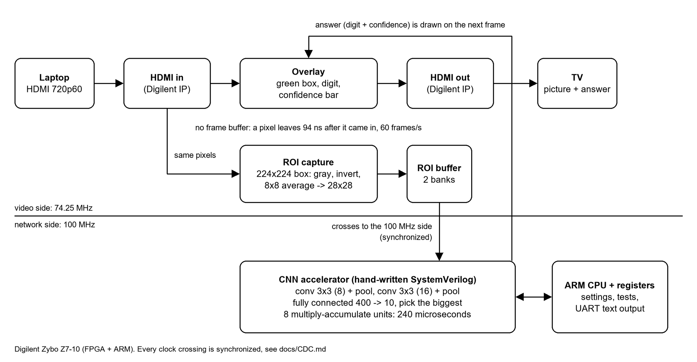

# Real-Time Edge AI Video Processor on FPGA

A laptop sends live HDMI video to a Zybo Z7-10 board. The video goes through the FPGA to a TV. On the way, a small neural network reads the digit drawn inside a box on the screen, and the answer is drawn on top of the picture. It runs at 60 frames per second. There is no frame buffer, so the video is never held back. The network is written by hand in SystemVerilog (no HLS and no ready-made AI block).


[Watch the 33-second demo on YouTube](https://youtu.be/mclvHZH5C0E). On the screen, from left to right: what the network sees (28x28), the green box, the answer and a confidence bar. If the box is empty, nothing is shown.

## Results

Every number was measured. [docs/RESULTS.md](docs/RESULTS.md) says how.

| What | Result |
|---|---|
| Video | 1280x720 at 60 Hz. 3,601 frames and 3,601 inferences in 60 s: 60.00 FPS, 0 frames skipped |
| Video delay | 7 pixel clocks (94 ns) |
| Network speed | 240 microseconds per image (23,965 clocks at 100 MHz, 8 MAC units) |
| Compared with the ARM CPU | 9.6 times faster than the same integer network in plain C on the board's ARM Cortex-A9 (2,293 microseconds, compiled with -O2) |
| MNIST accuracy | 97.96 % on all 10,000 test images, measured on the board. The hardware matched the Python model exactly (all 10 output sums) on every image |
| My own drawings | about 94 % on drawings the network had not seen (2-fold cross-validation). It was 79 % before fine-tuning on real captures |
| Size | 2,626 LUTs (15 %), 2,993 flip-flops, 5 block RAMs, 10 DSPs on the small XC7Z010 chip. The network alone uses about 900 LUTs and 0.025 W |
| Timing | Met on all clocks (worst slack +0.645 ns) |

## How it works



1. HDMI in. Digilent's `dvi2rgb` block turns the HDMI signal into pixels. A custom EDID makes the laptop send only 1280x720 at 60 Hz.
2. Video path (74.25 MHz). The pixels go straight through with a few clocks of delay. Small overlay blocks draw the green box, the digit and the confidence bar.
3. ROI capture. While the pixels pass, the 224x224 box in the middle is turned to gray, inverted (a dark pen on white becomes white on black, like MNIST), averaged in 8x8 blocks, and saved as a 28x28 image in a block RAM with two banks.
4. Clock crossing. The image and the "frame done" signal move to the 100 MHz clock with a dual-clock RAM, a pulse synchronizer and request/acknowledge handshakes. Each crossing is listed in [docs/CDC.md](docs/CDC.md).
5. Network (100 MHz). 28x28 image, then conv 3x3 (8 maps) with ReLU and pooling, conv 3x3 (16 maps) with ReLU and pooling, then a fully connected layer from 400 to 10. Everything is integer: int8 weights, uint8 activations, int32 sums. It has 5,224 weights and does 192,064 multiply-accumulates per image. The number of parallel MAC units (1 to 16) is a parameter.
6. Answer back to the video. The digit and the confidence cross back to the video clock and are drawn on the next frame. A minimum-confidence setting hides the answer when the input is empty or unclear.
7. ARM CPU (bare-metal C). It sets the options over AXI-Lite and prints the answer, the frame count and test results over UART. It can also write test images into the network. That is how the accuracy on the real board was measured.

## How it was checked

- One specification: [docs/QUANTIZATION.md](docs/QUANTIZATION.md) gives the exact integer math. A NumPy model (`ml/golden_int.py`) follows it, and a second, independent PyTorch version agrees with it on every layer.
- In simulation, the hardware matches the Python model in every layer on 20 images for each MAC count (1, 2, 4, 8, 16), and in the final outputs on 1,000 images (8 MACs). On the real board it matches on all 10,000 MNIST test images.
- Every module has a self-checking testbench, including the clock crossings. I also broke some designs on purpose (a simple bus synchronizer, a wrong comparison) to see that the testbenches catch the error.
- Timing is closed. The timing problems and their fixes are in [docs/TIMING.md](docs/TIMING.md).

## Speed and size for different numbers of MAC units

Network only, XC7Z010 chip, 100 MHz. Every version gives exact results and meets timing.

| MAC units | Time per image | DSP | LUTs |
|---|---|---|---|
| 1 | 1,767 microseconds | 3 | 726 |
| 2 | 893 microseconds | 4 | 758 |
| 4 | 457 microseconds | 6 | 787 |
| 8 (used in the demo) | 240 microseconds | 10 | 888 |
| 16 | 176 microseconds | 18 | 1,056 |

Going from 8 to 16 units is only 1.36 times faster, because the first layer has just 8 output maps and every pooled position has a fixed overhead. With 8 units the network needs 1.4 % of one video frame (16.7 ms).

## What was hard

- Real drawings are not MNIST. The first network was 98 % on MNIST but 79 % on digits drawn in Paint. For example, a 4 with a closed top was read as a 9. The hardware gave the same answers as the Python model, so the problem was the data. I fine-tuned on 140 captured drawings mixed with MNIST and got 94 % in cross-validation. I also tried the public USPS digits, which did not help, so they are not used.
- The overlay was in the wrong place. Windows said 1280x720 but sent 1080p, because the board's EDID also listed 1080p. A new EDID with only 720p fixed it ([scripts/make_edid.py](scripts/make_edid.py)).
- Timing. The first version of the network failed 100 MHz by 2 ns. Three different slow paths were fixed one by one, and the results were checked for exactness after each change.
- A fair speed test. The default compiler setting would have made the ARM look several times slower, so the baseline uses -O2. The ARM timer first returned 0 until the sleep call that starts it was added.

## Limits

- The 94 % comes from one person's 140 drawings, made with one tool in one session. Another person would probably get less.
- The final network was trained on all 140 drawings, so there is no untouched test set for it.
- The ARM baseline is plain C (no NEON, one core). A hand-optimized version would be faster than 2,293 microseconds.
- The power value (2.04 W) is Vivado's estimate, not a measurement. Most of it is the ARM and the DDR memory, not the network.
- One digit at a time, inside the box. The answer for frame N is shown on frame N+1.
- A review of the hardware found some edge cases that are not handled. They are listed in [docs/CDC.md](docs/CDC.md#known-limits-found-in-the-phase-8-review-2026-10-08). Examples: the box must stay on the screen (the ARM program makes sure of that, the hardware does not), the last digit stays on the screen if the HDMI cable is pulled, and the clock crossings have no max-delay constraints.

## Repository

| Folder | Contents |
|---|---|
| `rtl/` | SystemVerilog: video path, ROI capture, clock-crossing blocks, AXI-Lite registers, the network |
| `tb/` | Self-checking testbenches |
| `ml/` | Training, quantization, the integer Python model, fine-tuning, weight export, the 140 captured drawings |
| `sw/` | Bare-metal C for the ARM: live demo, MNIST benchmark, reference network in C |
| `scripts/` | Build, simulation, programming and measurement scripts |
| `constraints/` | Pin and clock constraints |
| `docs/` | Results, quantization, clock crossings, timing notes, glossary and interview questions |
| `notes/` | Project log and handover notes |

## Build and run

You need a Digilent Zybo Z7-10, Vivado and Vitis 2025.1 (Windows, PowerShell), Python 3.13, and a laptop with 1280x720 HDMI output. Everything is built from scripts. No hand-made project file is stored.

```powershell
git clone --recurse-submodules https://github.com/alvinhdr/FPGA-Edge-AI-Video.git
python -m venv .venv
.\.venv\Scripts\python.exe -m pip install torch torchvision --index-url https://download.pytorch.org/whl/cpu
.\.venv\Scripts\python.exe -m pip install -r ml/requirements.txt
.\.venv\Scripts\python.exe ml/download_mnist.py
.\.venv\Scripts\python.exe ml/export.py                        # weights, ROMs, test vectors

.\.venv\Scripts\python.exe scripts/sim_unit.py                 # unit testbenches
.\.venv\Scripts\python.exe scripts/sim_cnn.py --p 8 --n 1000   # network vs Python model

vivado -mode batch -source scripts/build_hw.tcl -tclargs all   # bitstream + XSA (about 10 min)
vitis -s scripts/build_sw.py edge_ai_demo                      # ARM program
xsdb scripts/program.tcl all edge_ai_demo                      # load the board over USB
```

Connect the laptop to the HDMI input and a monitor to the HDMI output. Open the UART at 115200 baud. Keys: `s` status, `p` prediction, `j` self-test on 20 images, `f` 60-second frame-rate test, `,` and `.` change the minimum confidence. [scripts/make_boot.py](scripts/make_boot.py) makes a `BOOT.bin` for a microSD card, so the board starts the demo by itself. The MNIST benchmark is [scripts/bench_mnist.py](scripts/bench_mnist.py).

## Next

- A camera (Digilent Pcam 5C) instead of the laptop.
- More classes (letters from EMNIST) and a bigger network. Per-channel quantization.
- A NEON version of the ARM baseline, and an HLS version of one layer, to compare with the hand-written RTL.
- Drawings from a second person as a clean test set.

## Documentation

[RESULTS](docs/RESULTS.md) (every number and how it was measured), [QUANTIZATION](docs/QUANTIZATION.md), [CDC](docs/CDC.md), [TIMING](docs/TIMING.md), [LEARNING](docs/LEARNING.md) (glossary and interview questions).

## Credits and license

HDMI input and output blocks: Digilent `vivado-library` (git submodule, with its own license). Dataset: MNIST. Training: PyTorch.

MIT license, see [LICENSE](LICENSE). The Digilent submodule and the MNIST dataset keep their own licenses.
